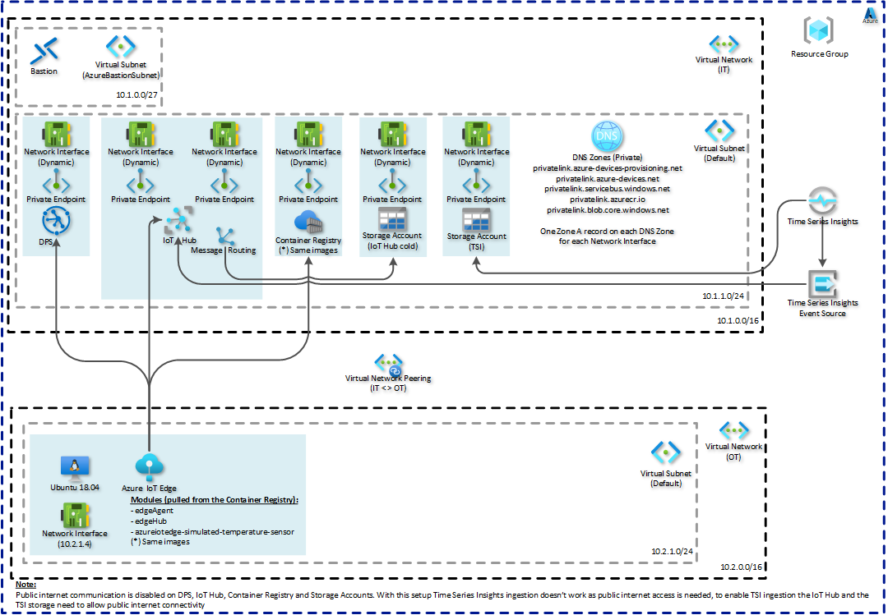

# Project Title

The purpose of this project is to setup an Azure resource group with a Sandbox environment of a simple Industrial IoT infrastrcuture from where a simulated device will send some telemetry data.

## Getting Started

For a quick start, clone this repository and run the `setup-bash-files.sh` follwed by the `create-all.azcli` bash scripts. These scripts were created on Windows running Ubuntu 20.04 on WSL2, but other Linux based platforms should work just fine.

On the first run of the script above, you'll be asked to create the `variables-local-only.azcli` script file with the instructions provided. Follow the instructions and execute the `create-all.azcli` script again.

To clean up all the resources execute the `remove-all.azcli` script (see notes below for more details).

On the sections below there's a description for each file present on the repository.

### Prerequisites

- An Azure Subscription where to run this script
- Script execution on a linux based shell (e.g. Ubuntu on WSL2)
- jq installed (apt-get install jq)
- openssl installed
- Docker (to pull/push images to ACR, see script `acr-push-images.azcli`)
- Azure CLI
- Azure CLI extension(s) needed:
  - azure-iot
  - timeseriesinsights

### Installing

The repository contains a set of bash (.azcli) scripts that, once executed, will create an Azure resource group to setup a Sandbox environment of a simple Industrial IoT infrastrcuture from where a simulated device will send some telemetry data.

Run the `setup-bash-files.sh` to give execution permission on the `*.azcli` files and then execute the `create-all.azcli` bash script to create all the resources in Azure.

On the first execution of the `create-all.azcli` the script will check if the `variables-local-only.azcli` is present, if not the script will stop and provide the instructions to setup this file. Create the file with the instructions provided and execute the script again.

Once the execution of the scripts ends, an Azure IoT Edge device simulator should be sending simulated telemetry data to an IoT Hub and this data should be visible on the following places:
- The Storage Account to where the IoT Hub message rounting is configured to keep data for cold storage analysis
- In Time Series Insights as long as the IoT Hub has the network configured to allow public connections (see note below).

> **Note 1**:
> - TSI ingest doesn't work if Public traffic is disabled on the IoT Hub and on the TSI Storage Account, for more info see: https://docs.microsoft.com/en-us/azure/time-series-insights/concepts-streaming-ingestion-event-sources#create-or-edit-event-sources
> - To have TSI data ingested, the IoT Hub and the TSI Storage Account network configurations need to allow Public connectivity, this is not the case if the `disable-public-traffic.azcli` is executed, which is the default case on the `create-all.azcli` script
> - [TODO]: A possible workaroud is to use and Event Hub between IoT Hub and TSI, but this also requires the Event Hub and the TSI Storage Account to allow Public connectivity
> - [TODO]: An alternative to TSI would be Azure Data Explorer

> **Note 2**:
> - If public network access is not allowed on the Storage Accounts (default case on the `create-all.azcli`), then a network firewall rule needs to be added with the local machine public IP address to allow access to the `cold-storage` container of the IoT Hub Storage Account and to the TSI Storgae Account environment container, to be able to see the blobs on these containers

## What will be created

The scripts will create the following resources:
- 1 Resource group (resource group where all the resources will be created)
- 2 VNets (IT and OT see details below)
  - IT Subnets: Default, AzureBastionSubnet
  - OT Subnets: Default
- 5 Private DNS Zones (to support the Private Endpoints DNS resolution) where Zone A records will also bre created
  - privatelink.azure-devices-provisioning.net
  - privatelink.azure-devices.net
  - privatelink.servicebus.windows.net
  - privatelink.azurecr.io
  - privatelink.blob.core.windows.net
- 1 Bastion (to provide secure access to the VM of the simulated IoT Edge device)
- Storage Account(s) for:
  - IoT Hub (for custom routing to cold storage)
  - TSI
- 1 Azure Container Registry (to store the IoT Edge simulated temperature module)
  - Private Endpoint + NIC on the IT Default Subnet
  - Image azureiotedge-simulated-temperature-sensor:1.0 pushed to the ACR
- 1 IoT Hub (to where the IoT Edge simulated device will be registered)
  - Private Endpoint + NIC on the IT Default Subnet
- 1 Device Provisioning Service (to provide an enrollment group from where the IoT Edge device will be provisioned)
  - Private Endpoint + NIC on the IT Default Subnet
- Private DNS Zone A records for all resources with an IP linked to the NIC of the Private Endpoints
- 1 Ubuntu 18.04 Virtual Machine (the IoT Edge simulated device)
- Time Series Insights

## More details on how to use the scripts
Create the `variables-local-only.azcli` (see details below), execute the `setup-bash-files.sh` and then the `create-all.azcli` to create all the resources.

Comment parts of the `create-all.azcli` to avoid the creation of all the resources mentioned above. Note that further adjustments might be needed to other scripts to ensure that all dependincies are managed in this case.

The `variables.azcli` is where all the variables are defined. Among others this script specifies the names of all the resources that will be created and these can be adjusted if needed.

To remove all resources execute the `remove-all.azcli`, see details below regarding resources that might need to be deleted manually.

## Script files details
- `create-all.zcli`: Creates all resources by invoking the individual scripts per resource type
- `remove-all`: Removes all created resources by deleting the resource group where the resources where created. Note that the `NetworkWatcherRG` is not removed has it might be present on the Subscription due to other needs, remove it manually if there're no other identified dependencies
- `colors.azcli`: Defines some bash colors to be used on the scripts
- `bash-functions.azcli`: Utility functions used by the scripts
- `variables-local-only.azcli`: This file is excluded from git and needs to be created to define the following variables
  - SUBSCRIPTION
  - RESOURCE_GROUP
  - PREFIX
  - VM_EDGE_ADMIN_USER
  - VM_EDGE_ADMIN_PASS
- `variables.azcli`: All the variables needed to run this script, values can be adjusted as needed on this file
- `vnets.azcli`: Creates the VNets (see more info below)
- `bastion.azcli`: Creates the Bastion to provide access to the IoT Edge simulator VM. If access is not needed the cal to this script can be commented out on the `create-all.azcli`
- `acr.azcli`: Creates the Azure Container Registry
- `acr-push-images`: Pulls / Tag / Pushes the docker images from public registeries to the ACR created here, the images are used by the IoT Edge simulator device
- `iothub.azcli`: Creates the Azure IoT Hub, configures the Edge deployments of the system and simulated temperature modules, and configures custom routes to a storage account and to the built-in events endpoint
- `dps.azcli`: Creates the Azure Device Provisioning Service, configures the linked Iot Hub and sets up an Enrollment Group
- `dns.azcli`: Creates the Private DNS Zones and links them to the VNets
- `vnets-create-private-endpoints.azcli`: Creates Private Endpoints for ACR, IoT Hub, DPS and Storage Accounts
- `dns-add-zone-records.azcli`: Adds private DNS Zones A records
- `disable-public-traffic.azcli`: Disables public access for ACR, IoT Hub, ([TODO:][due to az cli BUG] DPS) and Storage Accounts
- `tsi.azcli`: Creates the Time Series Insigths, TSI storage account, configures the IoT Hub consumer group for TSI and adds the IoT Hub as an event source for TSI
- `vm-edge-simulator.azcli`: Creates the VM to simulate the IoT Edge device

## Other files details
- `readme.md`: This file
- `setup-bash-files.sh`: To call `chmod` on all `.azcli` files
- `cloud-config\`
  - `vm-edge-simulator-custom-data.txt`: Cloud config file used to setup the IoT Edge simulator on the first boot of the VM that simulates the Edge device
- `edge-deployment-manifests\`
  - `manifest-system-modules.template`: Template file to be used to create the manifest-system-modules.json file with the proper values
  - `manifest-system-modules.json`: Generated file from the manifest-system-modules.template, can be safely deleted and is excluded from git to avoid commiting any sensible information
- `edge-deployment-manifests/`
  - `manifest-simulated-temperature.template`: Template file to be used to create the manifest-simulated-temperature.json file with the proper values
    - Note that the module was configured to send an unlimited number of messages by setting the environment variable MessageCount = -1 (see: https://github.com/Azure/iotedge/blob/027a509549a248647ed41ca7fe1dc508771c8123/edge-modules/SimulatedTemperatureSensor/src/Program.cs)
  - `manifest-simulated-temperature.json`: Generated file from the manifest-simulated-temperature.template, can be safely deleted and is excluded from git to avoid commiting any sensible information
- `reference-files\`
  - `install-iotedg.sh`: Script with the basic steps needed to install Azure IoT Edge daemon on a Lunix based device
  - `sample-config.yaml`: Sample file of the IoTEdge device configuration
- `resources\`
  - `Resources-diagram.vsdx`: Viso with the resources diagram
  - `Resources-diagram.png`: Image with the resources diagram to be used on this file

## VNets configuration
VNet: IT - Informational Technology
- Address space: 10.1.0.0/16
- Subnet: Default
  - Address space: 10.1.1.0/24
  - Resources:
    - DPS: 1 Private Endpoint, 1 NIC, 1 IP Address
    - IoT Hub: 1 Private Endpoint, 1 NIC, 2 IP Addresses
    - ACR: 1 Private Endpoint, 1 NIC, 2 IP Addresses
- Subnet: AzureBastionSubnet
  - Address space: 10.1.0.0/27
  - Resources: Bastion

VNet: OT - Operational Technology
- Address space: 10.2.0.0/16
- Subnet: Default
  - Address space: 10.2.1.0/24
  - Resources: VM for IoT Edge simulated device

Peered networks:
- IT <-> OT

## Known issues
- [TODO:] Due to a bug on the Azure CLI for DPS (see: https://github.com/Azure/azure-cli/issues/18184), as of 2021/06/07 it's not possible to disable the public traffic on DPS using the Azure CLI, so this needs to be done via the Azure Portal.

- [TODO]: Due to a bug on the Linux Kernel used by WSL2 (as of 2021/06/07) which causes the date/time to update if the PC hibernates/sleeps, the command `sudo hwclock -s` forces the date/time to update and avoids authentication errors on some az cli commands. Because of this issue this command is called on the `create-all.azcli` to prevent authentication issues. See reported issue on GitHub: https://github.com/microsoft/WSL/issues/5324